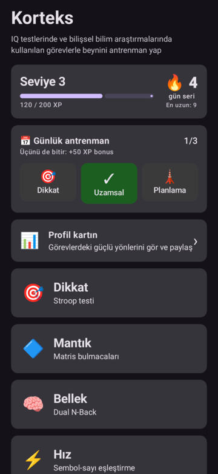
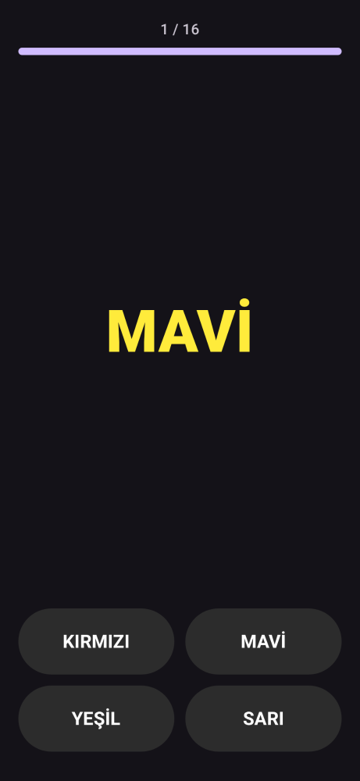
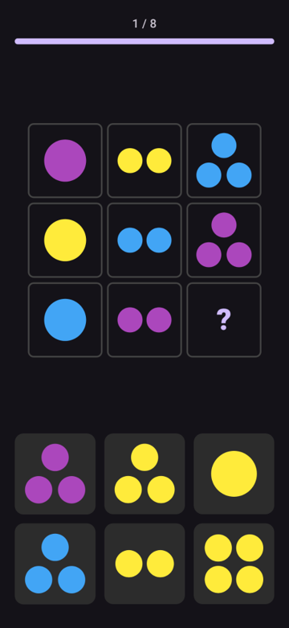
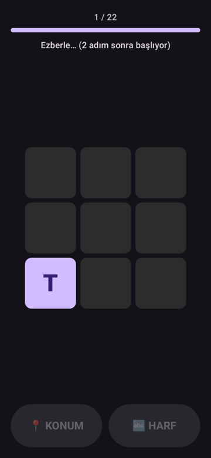
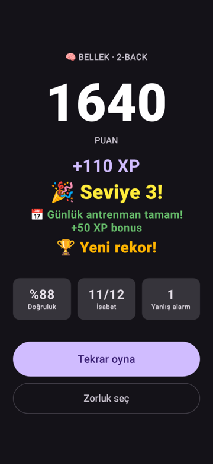
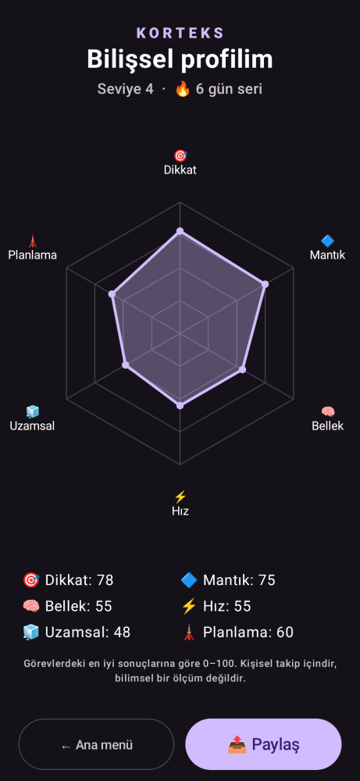
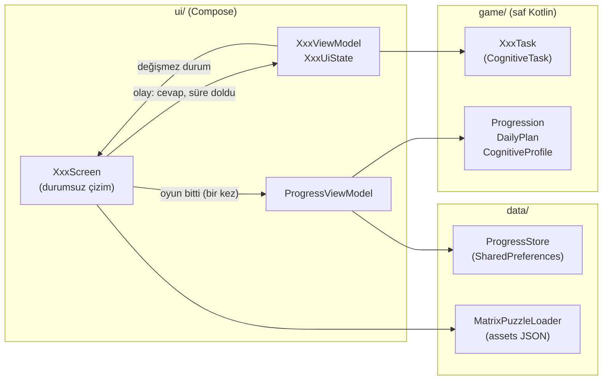

# Korteks

IQ testlerinde ve bilişsel bilim araştırmalarında kullanılan görevlerle beynini antrenman yap.

Korteks, bilişsel psikolojinin bilinen görevlerini (Stroop, Raven matrisleri, N-Back, Corsi blokları...)
kısa, tekrar oynanabilir oyunlara çeviren bir Android uygulaması. Tek oyunculu, çevrimdışı çalışır.

> Korteks bir antrenman ve kişisel takip uygulamasıdır. Zekayı artırdığı ya da IQ ölçtüğü iddiasında **bulunmaz**;
> profil kartındaki puanlar yalnızca oyuncunun kendi sonuçlarını karşılaştırması içindir, bilimsel bir ölçüm değildir.

<p>
  
  
  
  
  
  
</p>

## Görevler

| Sekme | Görev | Literatürdeki adı | Çalıştırdığı beceri |
|---|---|---|---|
| 🎯 Dikkat | Yazının rengini seç, anlamını değil | Stroop görevi (Stroop, 1935) | Dikkat kontrolü, ketleme |
| 🔷 Mantık | 3x3 tabloda eksik şekli bul | Raven Progresif Matrisleri tarzı | Örüntü bulma, akıcı akıl yürütme |
| 🧠 Bellek | Konum/harf N adım öncekiyle aynı mı? | Çift N-Back (Kirchner, 1958) | Çalışan bellek |
| ⚡ Hız | Sembolün rakamını olabildiğince hızlı bul | Sembol-sayı eşleştirme (SDMT) | İşlem hızı |
| 🧊 Uzamsal | Yanan blokları aynı/ters sırayla tekrarla | Corsi blok testi (Corsi, 1972) | Görsel-uzamsal bellek |
| 🗼 Planlama | Diskleri en az hamleyle taşı | Hanoi Kulesi (Lucas, 1883) | Planlama |

Her görevde 3 zorluk seviyesi ve bir "Bu görev nedir?" bilgi kartı bulunur.

## Özellikler

- **Seviye ve XP:** her oyun 10–110 XP; seviye eşikleri 100, 150, 200…
- **Günlük seri:** 🔥 ardışık oynanan gün sayısı ve en uzun seri
- **Rekorlar:** görev ve zorluk başına en iyi skor
- **Günlük antrenman:** her gün 3 görev; üçü bitince +50 XP
- **Profil kartı:** 6 görevin radar grafiği, PNG olarak paylaşılabilir (Instagram, WhatsApp...)
- **Tablet uyumu:** yatay ekranda taşmayan düzen
- Ekran yeniden kurulsa da (tema/dil değişimi, döndürme) oyun kaldığı yerden devam eder

## Mimari

Oyun motoru kullanılmadı: arayüz Jetpack Compose + Canvas, oyun döngüsü (game loop) Compose'un kare saatiyle (`withFrameMillis`) yazıldı.



Kullanılan tasarım desenleri:

| Desen | Projede nerede | Neden |
|---|---|---|
| **Katmanlı mimari** | `game/` → `data/` → `ui/` | Oyun mantığı Android'den bağımsız, JVM'de test edilir |
| **MVVM** | Her oyunda `XxxViewModel` | Durum ekrandan ayrı yaşar; Activity yeniden kurulunca kaybolmaz |
| **Tek yönlü veri akışı (UDF)** | `XxxUiState` aşağı, callback'ler yukarı | Ekran sadece durumu çizer, durumu tek bir yer değiştirir |
| **Durum makinesi (FSM)** | `sealed interface` Intro → Playing → Finished | Derleyici unutulan durumu yakalar |
| **Ortak arayüz (Strategy benzeri)** | `CognitiveTask` | Her görev aynı sözleşmeye uyar: soru, cevap, süre dolması, sonuç |
| **Bağımlılıkları dışarıdan verme (DI, elle)** | `Random` constructor'dan, tepki süresi parametreyle | Testte sabit tohum ve saat; tekrarlanabilir testler |
| **Veri güdümlü tasarım** | Matris bulmacaları JSON'da kural olarak | Yeni bulmaca için kod yazmak gerekmez; çeldiriciler kuraldan üretilir |
| **Tek doğruluk kaynağı** | `ProgressViewModel`, seviye XP'den hesaplanır | Seviye ve XP birbirinden kopamaz |

## Proje yapısı

```
app/src/main/java/com/buse/korteks/
├── MainActivity.kt          # giriş noktası, ekranlar arası geçiş
├── game/                    # saf Kotlin: görevler, puan, seviye, seri, günlük plan, profil
├── data/                    # SharedPreferences kaydı, JSON bulmaca okuyucu
└── ui/                      # Compose ekranları ve ViewModel'ler
app/src/main/assets/matrix_puzzles.json   # matris bulmacaları (kurallar)
app/src/test/                              # testler
```

## Derleme ve çalıştırma

Gereksinimler: JDK 17+, Android SDK (platform 37). Android Studio gerekmez, her şey terminalden çalışır.

```bash
./gradlew assembleDebug   # APK derle → app/build/outputs/apk/debug/app-debug.apk
./calistir.sh             # derle + bağlı telefona/emülatöre yükle + başlat
./gradlew test            # bütün testler
./onizle.sh               # ekranları emülatörsüz PNG olarak çiz (app/src/test/snapshots/images/)
./onizle.sh tablet        # yatay tablet önizlemeleri
```

Minimum Android 8.0 (API 26).

## Testler

| Tür | Araç | Ne doğrular |
|---|---|---|
| Oyun mantığı | JUnit (JVM) | Kurallar, puanlama, "her matrisin tek doğru cevabı var", seri ve rekor kuralları |
| ViewModel | JUnit (JVM) | Çift tıklama ve geç kalan sayaç gibi yarış durumları |
| Oynanış ve navigasyon | Robolectric + Compose UI test | Her oyun baştan sona oynanır, süreler elle ileri sarılır, geri tuşu, ekranın yeniden kurulması |
| Ekran önizlemeleri | Paparazzi | Telefon ve yatay tablette ekranların çizimi |

Testler emülatör gerektirmez.
